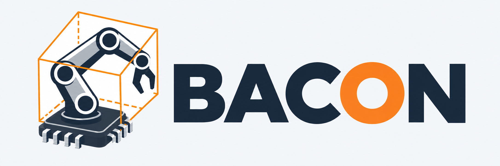
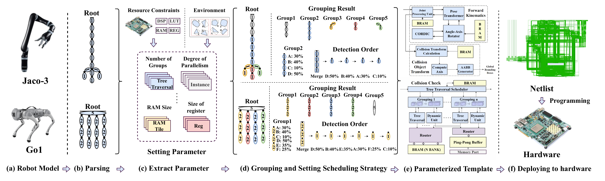

# BACON



Source code for [BACON: A Body-Aware Framework for Parameterized Collision Detection Acceleration](https://doi.org/10.1109/TCAD.2026.3664290), IEEE TCAD 2026.

Includes collision detection, MCTS grouping, and timing experiments for six robots: Fanuc, PRBT, Panda, Jaco-2, Jaco-3, and Go1. Hardware RTL is maintained separately.

## Workflow

[](assets/bacon-workflow.png)

*BACON workflow (Fig. 4 in the [paper](https://doi.org/10.1109/TCAD.2026.3664290)).*

## Quick start

Requires C++17, CMake >= 3.16, and ROS Noetic with the dependencies in the [build guide](docs/build.md).

```bash
git clone https://github.com/myonie-git/BACON.git
cd BACON
source /opt/ros/noetic/setup.bash
cmake -S . -B build -DCMAKE_BUILD_TYPE=Release
cmake --build build -j4
ctest --test-dir build --output-on-failure
```

The smoke check loads all six robot models and checks basic collision geometry and joint poses.

## Example

Run the PRBT CPU experiment from the repository root:

```bash
cmake --build build -j4 --target sim_cpu_prbt
./build/sim_cpu_prbt -d env/8
```

See the [experiment guide](docs/experiments.md) for other programs and the [build guide](docs/build.md#optional-dependencies) for CUDA and OMPL options.

## Citation and license

```bibtex
@ARTICLE{11396026,
  author={Xing, Yicheng and Feng, Dahu and Li, Hongyi and Ji, Xinglong and Zhao, Rong},
  journal={IEEE Transactions on Computer-Aided Design of Integrated Circuits and Systems},
  title={BACON: A Body-Aware Framework for Parameterized Collision Detection Acceleration},
  year={2026},
  volume={},
  number={},
  pages={1-1},
  keywords={Collision avoidance;Robots;Robot kinematics;Manipulators;Hardware;Trees (botanical);Real-time systems;Processor scheduling;Dynamic scheduling;Service robots;Motion Planning;Robotics Accelerator;Agile Development;Collision Detection},
  doi={10.1109/TCAD.2026.3664290}}
```

Original BACON code: [MIT](LICENSE). Third-party code and robot assets retain their [own licenses](THIRD_PARTY_NOTICES.md).
